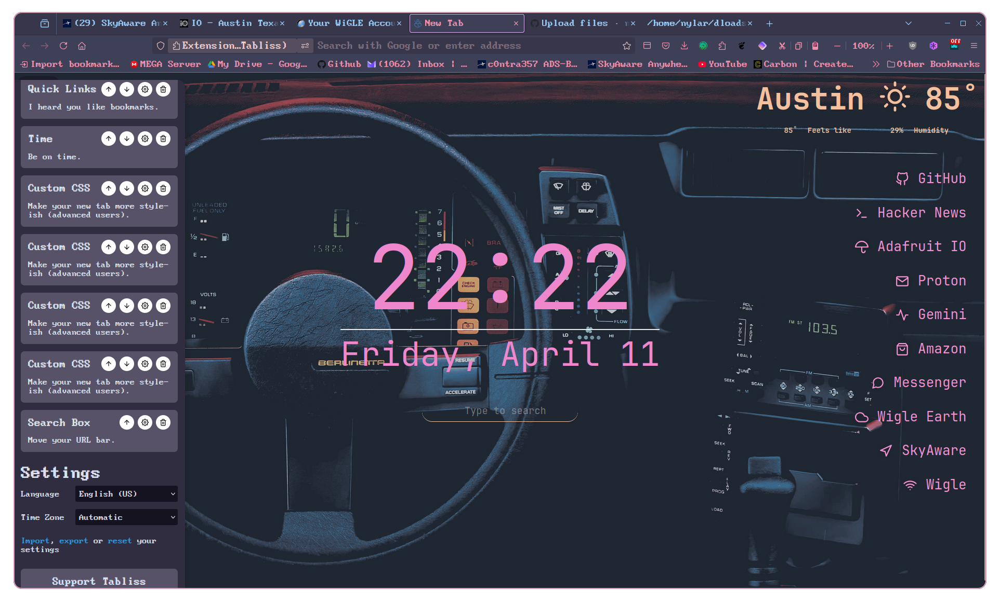
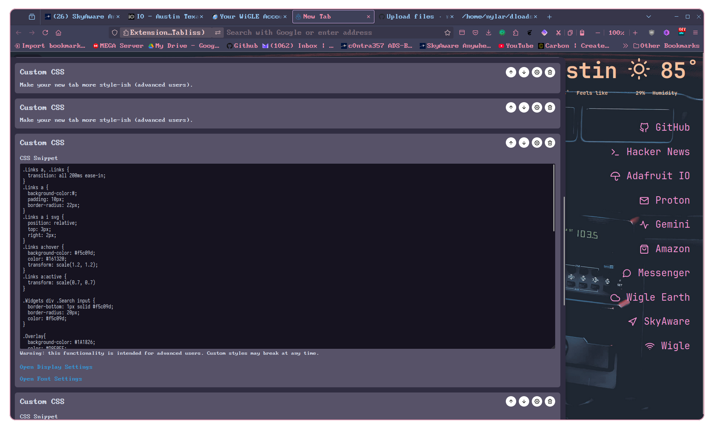

# Custom Tabliss CSS Themes                                                                                                                                                            
                                                                                                                                                                                       
A collection of custom CSS styles to personalize the look and feel of the [Tabliss](https://tabliss.io/) new tab browser extension.                                                    
                                                                                                                                                                                       
## What is Tabliss?                                                                                                                                                                    
                                                                                                                                                                                       
Tabliss is a beautiful, highly customizable new tab page replacement for web browsers like Chrome, Firefox, and Edge. It allows you to add widgets and personalize the background, fonts, and overall appearance. One powerful feature is the ability to add your own **Custom CSS**.
                                                                                                                                                                                       
## What Are These Files?                                                                                                                                                               
                                                                                                                                                                                       
This repository contains various `.css` files, each offering a different visual style or modification for your Tabliss new tab page. You can use them to change colors, fonts, widget layouts, add animations, or make other visual tweaks beyond the standard Tabliss settings.
                                                                                                                                                                                                                                     
## How to Use                                                                                                                                                                          
                                                                                                                                                                                       
Using these custom styles is straightforward:                                                                                                                                          
                                                                                                                                                                                       
1.  **Choose a Style:** Browse the `.css` files in this repository and decide which one you want to try.                                                                               
2.  **Copy the CSS:** Open the desired `.css` file and copy its entire content.                                                                                                        
3.  **Open Tabliss Settings:** Open a new browser tab (which should load Tabliss) and click the Settings icon (usually a gear ⚙️  located in one of the corners).                      
4.  **Navigate to Custom CSS:** Scroll down within the Tabliss settings panel until you find the **Advanced** section.                                                                 
5.  **Paste the Code:** Paste the CSS code you copied in step 2 into the text box labeled `Custom CSS`.                                                                                
6.  **Apply:** The changes should apply immediately. Close the settings panel.                                                                                                         
                                                                                                                                                                                       
**To remove a custom style**, simply delete the code from the `Custom CSS` box in the Tabliss settings.                                                                                
                                                                                                                                                                                       
## Previews                                                                                                                                                                            
                                                                                                                                                                                       
Here's a glimpse of what some of the themes can look like:                                                                                   
                                                                                                                                             
**Video Demo:**                                                                                                                              
                                                                                    
                                                                               
                                                                                                                      
                                                                                                                                             
**Screenshots:**                                                                                                                                                                                                                     
                                                                                                                                             
                                                                                     
                                                                               
                                                                               
                                                                                                                                             
                                                                                  
                                                                              
                                                                                                                                             
## Included Themes                                                                                                                           
                                                                                                                                             
*(Optional: You can list the specific themes/files here)*                                                                                    
                                                                                                                                             
*   Browse the different `.css` files in the repository to see the available styles. Each file might contain comments explaining its purpose.
                                                                                                                                             
## Contributing                                                                                                                              
                                                                                                                                             
Feel free to suggest improvements, report issues, or contribute your own themes via Pull Requests!                                           

## License                                                                                                                                                                                                                           

*(Optional: Add license information here, e.g., MIT License)*               
This project is licensed under the MIT License - see the LICENSE.md file for details.                                                            
